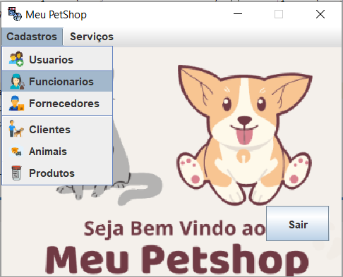
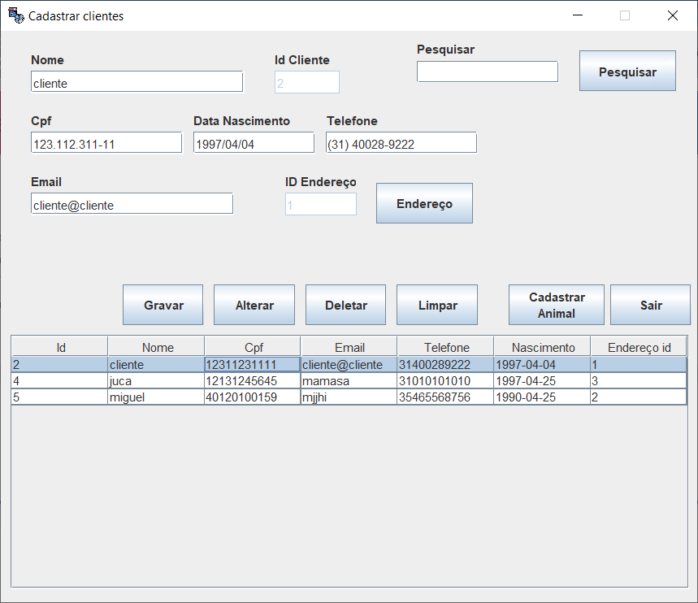
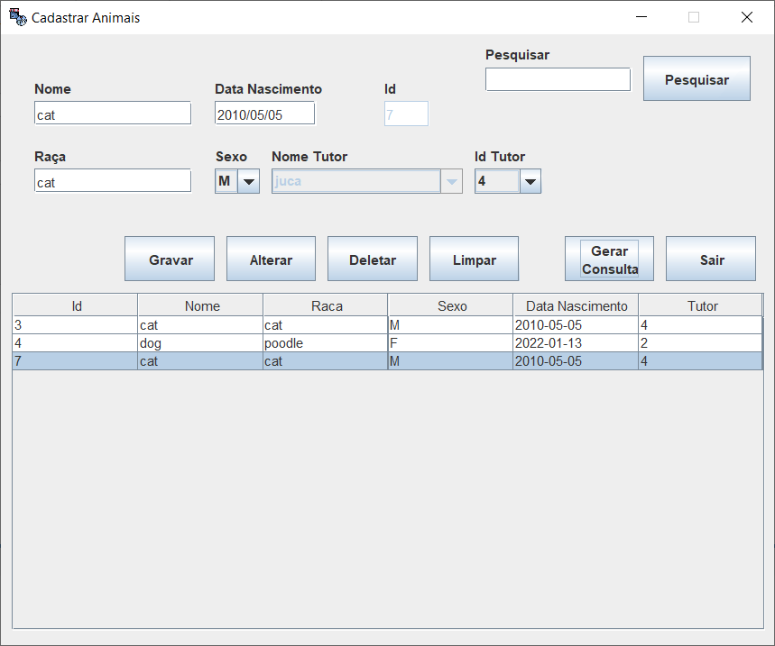

# Sistema de Gerenciamento Meu Petshop :post_office::dog:
Este aplicativo é um gerenciador de petshop foi construído utilizando os paradigmas de Programação Orientada a Objetos, Java, Swing JFrame e MySQL.
##### Funcionalidades:
* Tela de Login 
* Níveis de usuário (Administrador e Funcionário)
* Cadastro, Apagar e atualizar Usuário, Clientes, Animais, Funcionários, Fornecedores e Produtos
* Dados salvos diretamente no Banco de dados
* Exibição dos dados salvos
* Pesquisar dados salvos
* Limpar campos preenchidos

##### Instruções de compilação e execução

Para compilar e executar o programa: 
1. Basta clonar esse repositório
2. Adicionar a dependencia mysql-connector-j-8.0.32.jar ao projeto
3. Criar banco de dados local através do script petshop.sql

##### Capturas de tela:
 
  

